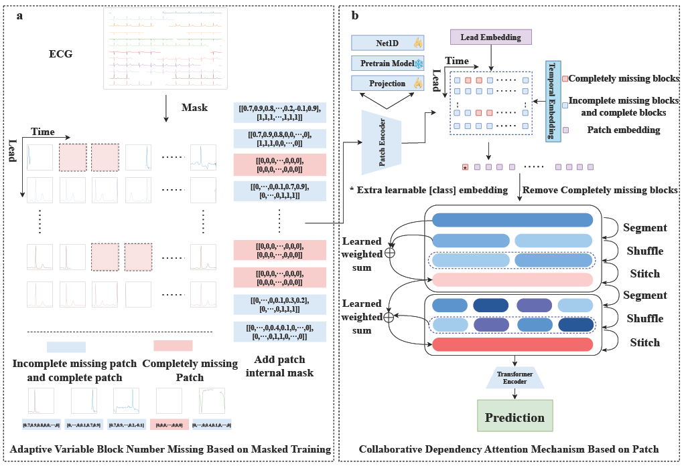

# PatchECG

Electrocardiogram (ECG) as an important tool for diagnosing cardiovascular diseases such as arrhythmia. Due to the differences in ECG layouts used by different hospitals, the digitized signals exhibit asynchronous lead time and partial blackout loss, which poses a serious challenge to existing models. To address this challenge, the study introduced PatchECG, a framework for adaptive variable block count missing representation learning based on a masking training strategy, which automatically focuses on key patches with collaborative dependencies between leads, thereby achieving key recognition of arrhythmia in ECGs with different layouts. Experiments were conducted on the PTB-XL dataset and 21388 asynchronous ECG images generated using ECG image kit tool, using the 23 Subclasses as labels. The proposed method demonstrated strong robustness under different layouts, with average Area Under the Receiver Operating Characteristic Curve (AUROC) of 0.835 and remained stable (unchanged with layout changes). In external validation based on 400 real ECG images data from Chaoyang Hospital, the AUROC for atrial fibrillation diagnosis reached 0.778; On 12 x 1 layout ECGs, AUROC reaches 0.893. This result is superior to various classic interpolation and baseline methods, and compared to the current optimal large-scale pre-training model ECGFounder, it has improved by 0.111 and 0.19.

## 1、Framework Overview


## 2、Data 

1、PTB-XL ：https://physionet.org/content/ptb-xl/1.0.3/

2、We used the tool provided by ECG-image-kit to generate 21388 ECG images with 3 x 4 layouts of different noise levels on the PTB-XL dataset, and further transformed these images into high-quality ECG signal data that can be used for subsequent analysis using the digital tool , which ranked first in the 2024 CINC competition.

https://github.com/felixkrones/ECG-Digitiser

3、chaoyang hospital AF

## 3、Train

model ：Save in the cloud and upload later

The overall structure is modified based on PhysioNet Challenge 2024

code_v5.py ：train subclass

code_v5_AF.py：train AF

code_v5_AF_eva.ipynb ：eva AF

code_v5_eval.py ：eva


**Train model：**

```bash
python -u train_model.py -d /data/ -m model -v --verbose
```

**Eva model：**

```bash
python eva_model.py -p1 ../eva/ex1/picture/AUC_3fold_layout_2 -p2 ../eva/ex1/table/sub_3fold.xlsx -l 2 -v --verbose
```


## 4、PatchECG is Highly Scalable

**Ours-projection** ：

/PatchECG/src/code_v5_projection.py

**Ours-ECGFounder** ：

/baseline/ECGFounder/PatchEncoder

## 5、Reference

We appreciate your citations if you find our paper related and useful to your research!

```
@article{zhang2025masked,
  title={Masked Training for Robust Arrhythmia Detection from Digitalized Multiple Layout ECG Images},
  author={Zhang, Shanwei and Zhang, Deyun and Tao, Yirao and Wang, Kexin and Geng, Shijia and Li, Jun and Zhao, Qinghao and Liu, Xingpeng and Zhou, Yuxi and Hong, Shenda},
  journal={arXiv preprint arXiv:2508.09165},
  year={2025}
}
```

# Baseline

## 1、Medformer

For the operating environment, refer to the Medformer environment.

Loading the dataset is mainly modified in data_factory.py

```bash
nohup python -u run.py --task_name my_classification --is_training 1 --root_path ./ --model_id PTB-XL-Indep --model Medformer --data my_data --e_layers 6 --batch_size 16 --d_model 128 --d_ff 256 --patch_len_list 2,4,8,8,16,16,16,16,32,32,32,32,32,32,32,32 --augmentations flip0.5,shuffle0.5,frequency0.1,jitter0.2,scale0.2,mask0.1,drop0.5 --swa --des 'Exp' --itr 5 --learning_rate 0.0001 --train_epochs 30 --patience 10 --activation gelu --gpu 9 > ./table_chaoyang/2025_4_22_medformer_chaoyang 2>&1 &
```

table ： save experimental results

Medformer code ：https://github.com/DL4mHealth/Medformer


## 2、SimMTM

For the operating environment, refer to the SimMTM environment.

SimMTM ：https://github.com/thuml/SimMTM

### 1、zero padding

### 2、KNN imputation

```bash
python gen_from_pic_knn.py
```

### 3、SAITS imputation

For the operating environment, refer to the SAITS environment.

SAITS：The trained model and padded dataset are too large and are stored in a cloud disk.

Model and Data : Save in the cloud and upload later.

Need to:

- generated_datasets ：Interpolated data
- NIPS_results ：model and some train logs

Put it in the SAITS-main directory.

1、Create env

```
conda env create -f conda_env_dependencies.yml
```

2、Add config

```
Ptb_SAITS_base.ini
```

3、Generate data

```
python gene_ptb_xl_dataset_saits.py \
  --artificial_missing_rate 0.1 \
  --dataset_name ptb_xl_fold5_layout0 \
  --layout 0 \
  --fold 5 \
  --saving_path ../generated_datasets
```

layout

0 : 3 x 4
1 : 3 x 4 + Ⅱ
2 : 3 x 4 + Ⅱ + V1
3 : 2 x 6 
4 : 2 x 6+Ⅱ
5 : 12
6 : random

4、imputed data

```bash
python run_models.py \
    --config_path configs/Ptb_SAITS_base.ini \
    --test_mode
```


**SimMTM Parameter**

```
elayers 3
d_model 128
pre-train
lr : 1e-4
batchsize = 128
epoch = 10
fine-tuning
lr :1e-4
loss : cross-
batch size:32
epoch :300
```

run :

```
python ./code/main.py --training_mode pre_train --pretrain_dataset SleepEEG --target_dataset Epilepsy --device cuda:0
```

Just adjust the dataset, some parameter names remain unchanged for easy code execution.

table ：save experimental results

code :https://github.com/WenjieDu/SAITS


## 3、TimeXer

For the operating environment, refer to the TimeXer environment.

```bash
# The dataset name does not affect it, and the dataset path is not modified here.
nohup python3 -u run.py --task_name my_classificaion --is_training 1 --root_path ./dataset/electricity/ --data_path electricity.csv --model_id ECL_96_96 --model TimeXer --data ptb --features M --seq_len 1000 --label_len 48 --pred_len 23 --e_layers 1 --factor 3 --enc_in 12 --dec_in 12 --c_out 23 --batch_size 16 --itr 1 --gpu 9 > ./logs/2025_4_22_chaoyang 2>&1 &
```

table ： save experimental results

code :  https://github.com/thuml/TimeXer


## 4、ECGFounder

For the operating environment, refer to the ECGFounder environment.

Missing items are directly filled with 0.

test_chaoyang_ECGFounder.ipynb ：chaoyang hospital AF data

run :

```bash
python code_v5.py
```

eva:

```bash
python code_v5_eva.py
```

model 保存在网盘：

code : https://github.com/PKUDigitalHealth/ECGFounder


